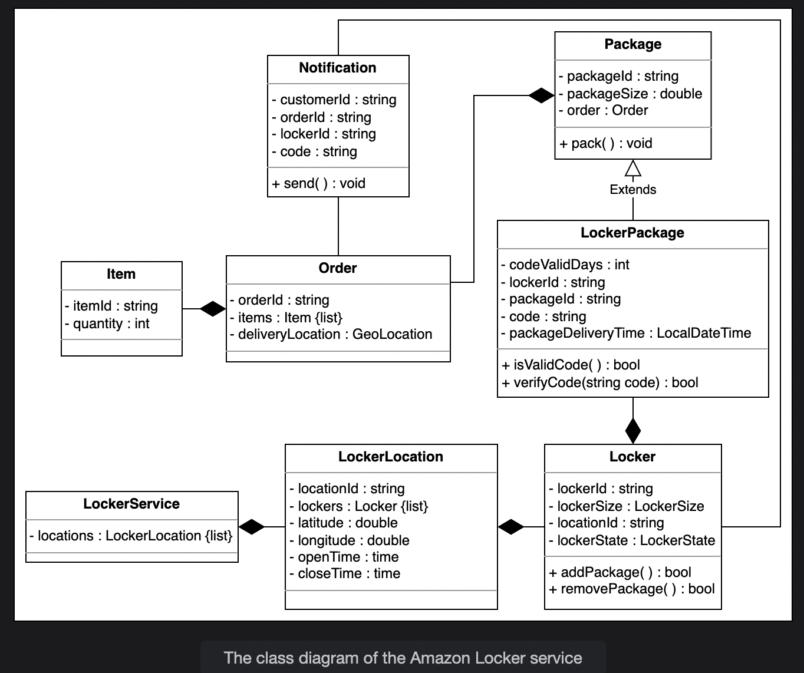

# Requirements
  - R1: While ordering the item(s), the customer can choose the nearest
    location to pick up the order package from the locker.
  - R2: One or more items can be contained in one order. An order will be
    placed in a package before the delivery.
  - R3: There can be different sizes of lockers including extra small, small,
    medium, large, extra large, and double extra large.
  - R4: The locker is assigned to the customer based on the size of the order
    package.
  - R5: When the order package is delivered to the locker location specified
    by the customer, a 6-digit code will be sent to the customer to open the locker.
  - R6: The package will be kept or placed inside the locker for three days only.
  - R7: If the customer doesn't pick the order in 3 days, refund process will be
    initiated.
  - R8: Only eligible packages can be placed in the locker such that the size of 
    the package must be less than the size of the locker.
  - R9: There can be multiple lockers at every locker location.
  - R10: Every locker location is open and closed with a schedule.
  - R11: The item can be returned to the locker if customer isn't satisfied.
  - R12: To return an item, the customer needs to choose the nearest locker 
    location. An available locker will be assigned to them based on the size
    and location.
  - R13: When the customer picks up the order package from the locker, the locker's
    state is changed to closed, and the customer will no longer be able to open the 
    locker with the given code.

# Clarifying questions:
  - Locker size:
    - will every locker be of the same size?
    - is there any size restriction on an item that can be kept in the locker?
    
  - Locker selection:
    - How will the system make sure that multiple customers do not get the same locker?
    - Will the customer choose the locker of his own choice, or will the system assign her
      a locker based on availability?
    - can a customer get two lockers for different orders at the same time?
    - will the system keep in mind the locker and package size while assigning the 
      locker to the customer?

  - Locker status:
    - is there a time constraint on the package that can be kept in the locker?
    - what will happen if the customer does not come to pick up his package within the
      valid time period
  
  - Returning an item:
    - Can the customer return an item through Amazon locker service?
    - If yes, will they get the same locker from which they picked up the item?
    - How will the locker be assigned to the customer while returning an item?

# Imp design patterns for this problem:
    1. Factory design pattern: 
       Allow for creation of different types of lockers with a consistent interface.

    2. Observer design pattern:
       To build a notification system for users by establishing a one-to-many dependency
       between lockers and interested observers.

    3. Strategy design pattern:
       This pattern defines interchangeable algorithms for locker selection and management,
       allowing dynamic selection based on specific user preferences or system conditions.
    
    4. State design pattern:
       This pattern models different states of lockers and facilitates smooth transition
       between states, making it easier to manager and represent the lifecycle of a locker.

# Actors:
    1. Customer:
        - Enter code
        - Add product
        - Remove product
        - Delivery notification
        - Submit return request
        - Overdue notification

    2. Delivery guy:
        - Enter code
        - Add product
        - Remove product
        - Return notification

    3. System:
        - Validate code
        - Find locker
        - lock/unlock door
        - return notification
        - generate code
        - issue locker
        - overdue notification
        - delivery notification

# Entities:
    1. Item - each item of the order.
    2. Order - 
    3. Notification
    4. Package and LockerPackage
    5. Locker
    6. LockerLocation
    7. LockerService
    8. Enums:
        i. LockerStatus - CLOSED, BOOKED, AVAILABLE
        ii. LockerSize - XSM, SM, MED, LG, XLG, XXLG

# Class diagram:
